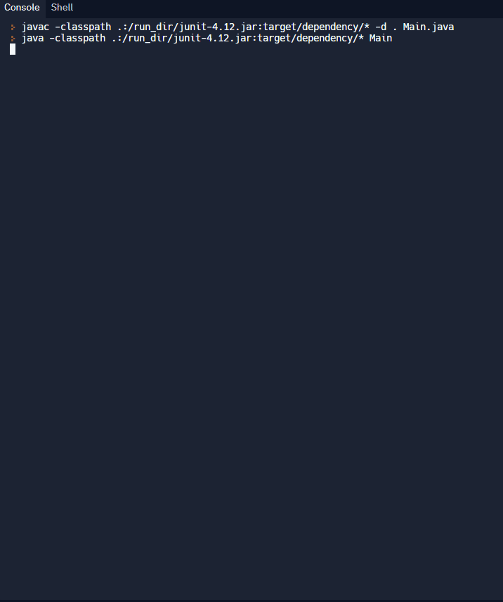

---
title: "Java: TicTacToe"
description: "Learn how to make a console based TicTacToe game in Java"
date: 2021-10-14T00:00:00Z
prereq: "Java: Basics"
difficulty: "Intermediate"
icofdsafddsfntents

{}

## Demo
fddgfdg
The following gif shows you tgsgfe program that you will create by the end of the workshop! Check it out!

<iframe height="600px" width="100%" 
 src="https://replit.com/@nuevofoundatigdfvaTicTacToeDemo?lite=true&outputonly=1" scrolling="no" frameborder="no" allowtransparency="true" allowfullscreen="true" sandbox="allow-forms allow-pointer-lock allow-popups allow-same-origin allow-scripts allow-modals"></iframe>
fgdsgfdg